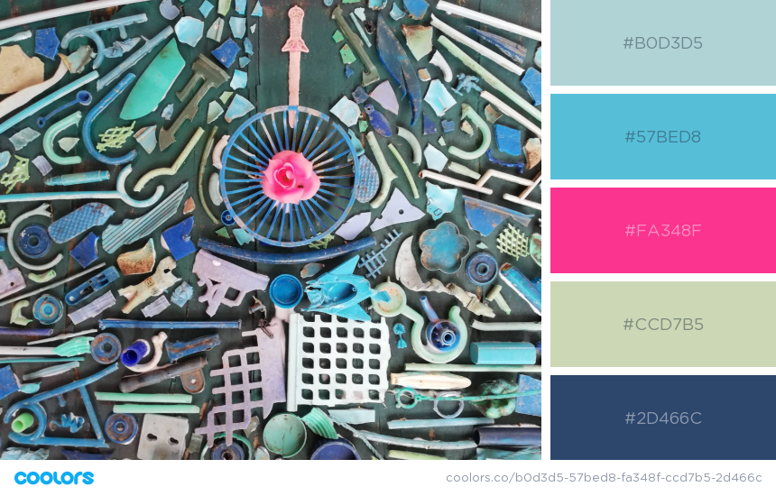

#  artnotwaste

Client project. This is a website which is promoting people to make art with waste. 

This was an individual project. The objective was to create a responsive website built with frontend  HTML, CSS, Bootstrap and JavaScript and backend Node.js and MongoDB.
Agile management from [trello](https://trello.com).

**Take a look ?** [Demo](https://walter-clayton.github.io/artnotwaste/)

## Features

#### Login

#### Comments

#### Color Theme

#### Search

#### Bonuses - Newsletter [Mailchimp](https://mailchimp.com/en/) + API [themoviedb](https://www.themoviedb.org/documentation/api)

## Instructions for contributors

if you would like to contribute 

:smiley: [Click here](contribute.md)

## Built with

* HTML5
* CSS3
* Javascript
* Bootstrap
* [Figma](https://www.figma.com/file/hCZo3ab4eSNDKp3VBJLbdG/Make-Art-Not-Waste?node-id=0%3A1) 
* [Trello](https://trello.com/b/8x5yzqEL/make-art-not-waste)

* Node.js
* MongoDB

## Author

 **Walter Clayton** - [GitHub](https://github.com/walter-clayton) 

## Acknowledgment

* Thank you [BeCode](https://www.becode.org) for putting the team together!
* Inspired by [Nina Clayton](https://www.facebook.com/artnotwaste/) [Facebook page]
